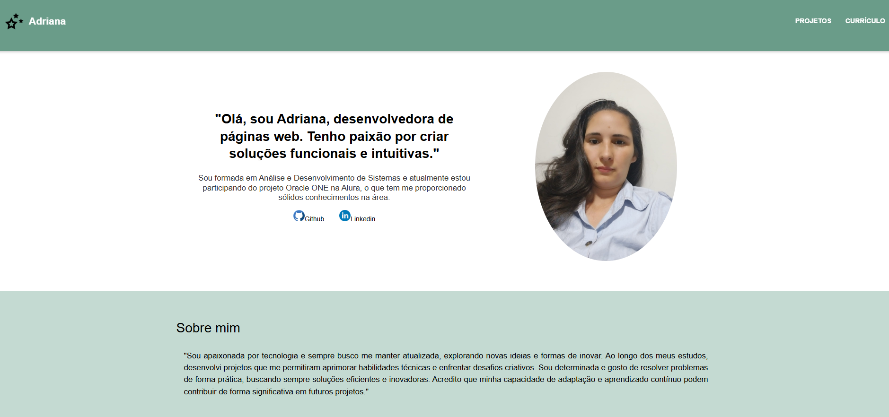
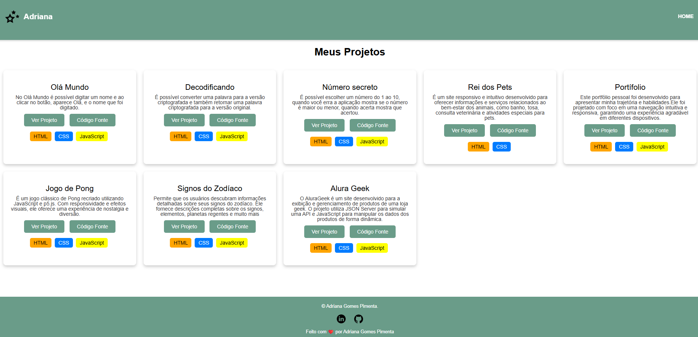
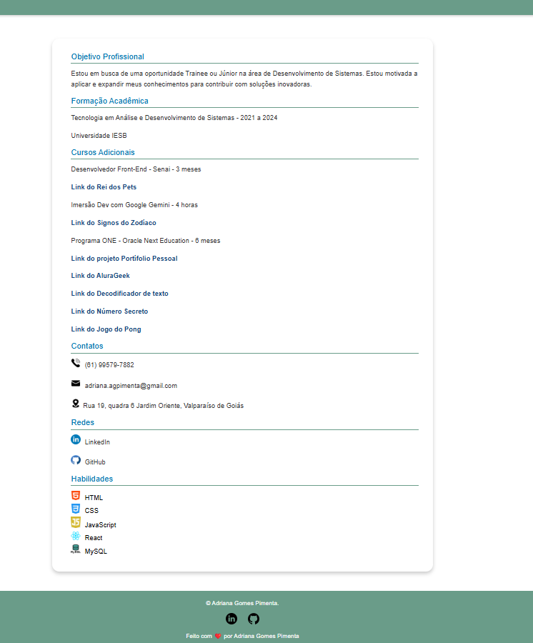

# Portfólio Pessoal 🌟

Bem-vindo(a) ao meu portfólio pessoal! Este site foi desenvolvido com o objetivo de apresentar meus projetos, habilidades e um pouco mais sobre mim de forma criativa e interativa. 🚀

## 🖥️ Estrutura do Site

- **Menu de Navegação**:
  - **Projetos**: Uma seção dedicada aos projetos que desenvolvi, com descrições e detalhes técnicos.
  - **Currículo**: Acesso ao meu currículo, destacando minha trajetória acadêmica.

- **Sobre Mim**:
  Logo abaixo do menu, você encontrará uma breve descrição sobre quem sou, o que faço e quais são meus hobbies e interesses.

- **Habilidades**:
  Uma seção que apresenta as tecnologias e ferramentas nas quais tenho experiência, como:
  - HTML5, CSS3, JavaScript.
 
 ## 🌟 Visão Geral do Site

Aqui estão algumas capturas de tela do meu portfólio:

### Página Inicial

### Seção de Projetos

### Seção de Currículo

## 🎯 Objetivo

O objetivo do site é criar um espaço para compartilhar meu crescimento profissional e me conectar com possíveis oportunidades no mercado de trabalho. 😊

## 🚀 Tecnologias Utilizadas

- **Frontend**: HTML, CSS, JavaScript.
- **Design Responsivo**: Garantindo uma boa experiência em diferentes dispositivos.
- **Efeitos Visuais**: Incluindo animações e interatividade.

---

Você pode acessar o site através deste link: [https://challenge-portfolio-principal.vercel.app/].

---

Espero que goste! 😄
